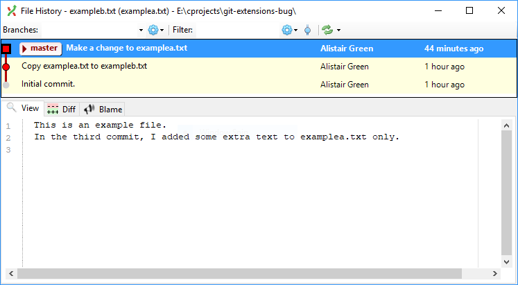

# Git Extensions: Blame opens wrong file - [Issue #2452](https://github.com/gitextensions/gitextensions/issues/2452)

This is an example repository that demonstrates surprising behaviour in the
[Git Extensions](https://gitextensions.github.io/) file history viewer.

There are two text files, `examplea.txt` and `exampleb.txt`. File B has the same content as a previous version of A.

At the command line, `git log --follow` and `git blame` behave exactly as you would expect:

```
PS E:\cprojects\git-extensions-bug> git log --follow exampleb.txt
commit 4dc7c5acecbc2290ea20af911047a7df4952f09f
Author: Alistair Green
Date:   Fri Dec 29 15:23:20 2017 +0000

    Copy examplea.txt to exampleb.txt

commit 00892bc32a7f8c4f2c8e208a89c49309dc7b3f84
Author: Alistair Green
Date:   Fri Dec 29 15:22:25 2017 +0000

    Initial commit.


PS E:\cprojects\git-extensions-bug> git blame exampleb.txt
4dc7c5ac (Alistair Green 2017-12-29 15:23:20 +0000 1) This is an example file.
```

However, Git Extensions behaves differently. Enable "Follow renames in file history (Experimental)" in the Git Extensions settings (*this was set by default on my machine*), then right-click on `exampleb.txt` in Windows Explorer and select Git Extensions --> File History.

It concludes that `exampleb.txt` was renamed to `examplea.txt` in the most recent revision, and shows you the contents and history of `examplea.txt` instead of the file that you actually clicked on:



To put it another way:
* `git log --follow` looks *backwards* in time.
* Git extensions looks *forwards and backwards in time* and shows you the *most recent* version of the content by default - which may not be the version that you clicked on.
